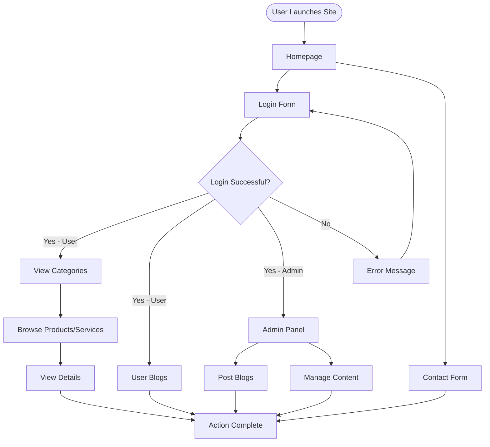

# Capstone Project – Velle

## Introduction
**Velle** is a web-based platform for showcasing, managing, and browsing customized T-shirt and hoodie products, printing services, and related blogs. Built as a capstone project, Velle aims to provide users with a smooth experience to explore products by category, read blogs, contact the team, and—for admins—manage content directly from the web interface.

## Features
- Browse categorized products (men, women, T-shirts, hoodies, services)
- View product details and gallery
- Blog section for users (visible post-login)
- Secure login for blog access (for demonstration)
- Admin login (basic; can be extended for CMS features)
- Contact us form and information
- Responsive design using HTML, CSS, and EJS templating

## Tech Stack
| Area           | Technology                |
| -------------- | ------------------------ |
| Language       | JavaScript (ES6+)        |
| Backend        | Node.js, Express.js      |
| Frontend       | EJS Templating Engine    |
| Middleware     | body-parser, morgan      |
| Styling        | CSS/Bootstrap (static)   |
| Hosting/Port   | Runs on localhost:3000   |

## Project Structure
- `/views` — EJS template files for UI rendering
- `/public` — Static assets: CSS, JS, images, SVGs
- `/script` — Client-side scripts
- `/styles` — Custom styles
- `index.js` — Main application entrypoint and server logic
- `package.json` — Project dependencies and script metadata

## Working & Flow

1. **User visits homepage**
2. User can:
   - Browse categories (men/women/products/services)
   - Access and submit the contact form
   - Attempt login
3. **Login process:**
   - Enter credentials
   - If correct: redirected to user blog dashboard
   - If incorrect: error message displayed
4. **Browsing products/services:** Navigate various pages, see details, gallery, testimonials, etc.
5. **Admin Workflow:** Able to log in, post blogs, manage content.

---

## Project Flowchart



---

## How to Run

### Prerequisites
- Node.js v14+ and npm (Node Package Manager)
- Internet browser (Chrome/Edge/Firefox)

### Installation

```bash
# Clone the repository
git clone https://github.com/sayedjaynurali/node_express_ejs_capstoneProject.git

# Navigate to the project directory
cd node_express_ejs_capstoneProject/Capstone\ Project\ -\ Velle

# Install dependencies
npm install
```

### Running the App

```bash
# Start the server
node index.js
# or using npm (if configured):
npm start
```
- Open your browser and visit: `http://localhost:3000`

### Default Login Credentials (for demo)
- **Username:** jaynur  
- **Password:** juned  

---

## Requirements
- Node.js and npm installed
- No external database connection required (uses in-memory logic for demo)
- All static files and dependencies are managed via npm and local folder structure

## Customization / Extending
- Add more routes and EJS templates in `/views`
- Add/modify assets and scripts in `/public`
- Extend authentication and admin logic in `index.js`

## Contact
- **Email:** jaynursayedali@gmail.com

---

**Project created as a demonstration for capstone submission and for future expansion into a complete CMS/eCommerce solution.**
